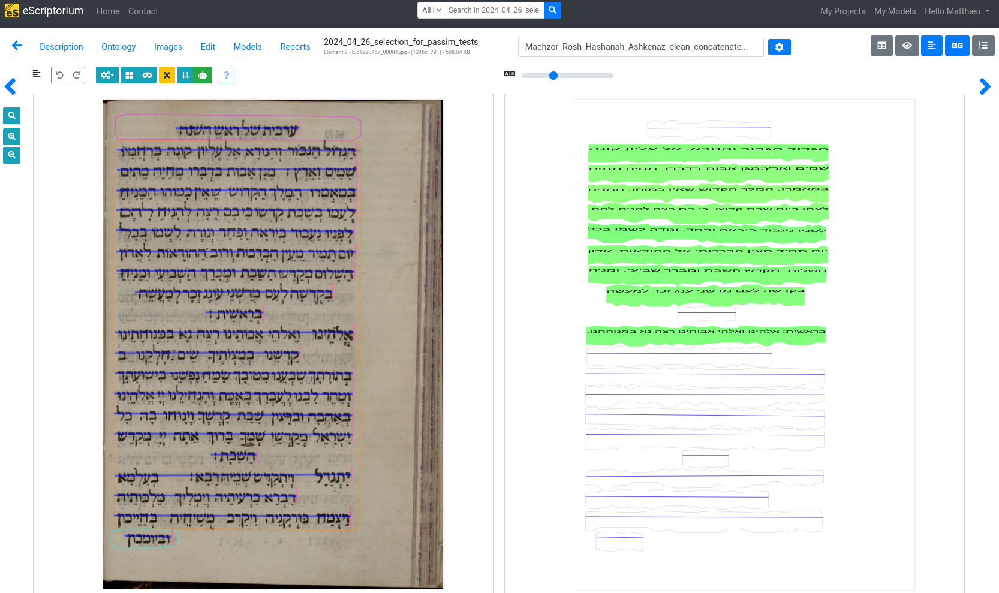
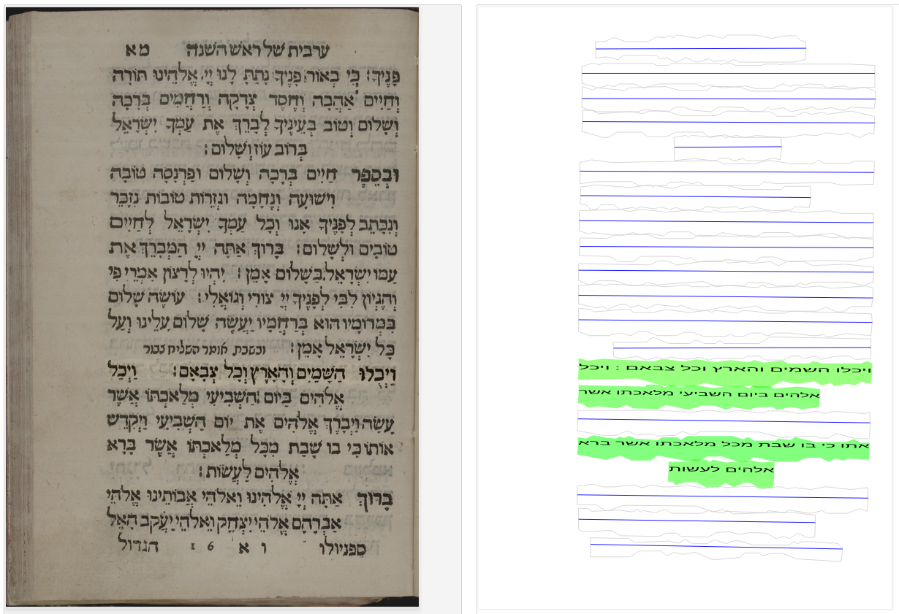
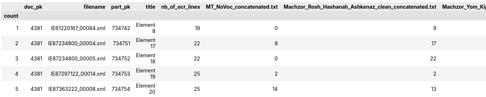
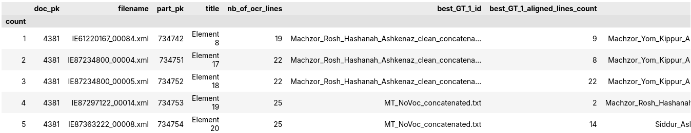

This repository is a work in progress.
Scheduled delivery date: 06/25/2024
# Aligning large quantities of digital text on large numbers of ocerized manuscripts/prints.



## Pipeline purpose
The function of the scripts in this repository is to enable the alignment of known digital texts with large numbers of digitized manuscripts or prints.

To improve a character recognition model, it is necessary to train it by providing it with transcribed lines of textual content.
This method is expansive in terms of time and human resources.

By aligning digital texts with manuscript images, it is possible to reduce the cost of training a character recognition model.

The principle is as follows:
- textual content is extracted from manuscript images using Kraken OCR software (integrated into eScriptorium).
- Using algorithmic tools like Passim, the extracted text is compared with multiple known digital texts that constitute the ground truth (GT).
- When matches are found between OCR and GT, the two texts are aligned.
- A character recognition model can then be trained on these alignments, avoiding the need to manually transcribe text from manuscript images.

The aim of this pipeline is therefore to align large numbers of known numerical texts with large numbers of documents (manuscripts or prints).

**The pipeline has been tested on batches of more than 7000 manuscript images and 150 known digital texts and corpus like the Hebrew Bible, Talmuds, Mishnah, Midrashim, etc.**
  

## Pipeline steps

1. **Text retrieval from eScriptorium**. Altos XML files containing OCR lines from document images are retrieved from eScriptorium. The user selects the document to be processed and the regions of the page to be aligned (e.g. 'Main Central', 'Main Left').
2. **Prepare XML files for alignment**. XML files are prepared for alignment. OCR lines are extracted from the altos XML files and concatenated into blocks of text (corresponding to page regions, e.g. 'Main Central', 'Main Left'). These strings are integrated into a dictionary, which also contains a unique identifier for each block of text. Known digital texts (GT) to be aligned are added to these dictionaries. These texts come from the [Sefaria](https://www.sefaria.org/texts) API. They have been retrieved, cleaned and prepared by the script available at [this address](https://github.com/Freymat/from_Sefaria_to_Passim).
3. **Search for alignments with Passim**. Alignments are searched with [Passim](https://github.com/dasmiq/passim) via a sub-process.
4. **Alignment recovery and integration into XML files**. Valid alignments (above a certain Levenshtein distance threshold) are reintegrated into the altos XML files. The content of each OCR line is replaced by the aligned text, if valid. OCR lines without valid alignment are replaced by empty text.
5. **Summary of results**. Several summary files are generated to evaluate alignment quality. An alignment register contains alignment information for each page. Two tsv files are created, giving for each page and each GT the number of aligned lines, and the length of successive line clusters. These files are invaluable for quickly identifying alignments in XML/manuscript files.
6. **Re-import XML files into eScriptorium**. The modified altos files are then reimported into eScriptorium via its API. A transcription layer is created for each GT aligned in eScriptorium. The user can then view the alignment result in eScriptorium.

Example of alignment in eScriptorium (left: picture of text page, right: alignment found with a levensthein ratio greater than 0.8) :



## Results
The pipeline provides the following results:
- `data/output/xmls_for_eSc/` : XML files ready to be re-imported into eScriptorium. The files are organized by ground truth (GT) detected as aligned. Once imported into eScriptorium, a transcription layer is created for each GT. The layer contains the lines selected for alignment. The other lines are empty.

- `data/output/alignment_register/` : a dictionary listing the alignments found on each page.

```json
{
        "filename": "IE87234800_00004.xml",
        "part_pk": 734751,
        "part_title": "Element 17",
        "levenshtein_threshold": 0.8,
        "total_aligned_lines_count": 17,
        "aligned_clusters_size": [
            8,
            5,
            1,
            3
        ],
        "GT_id": "Machzor_Rosh_Hashanah_Ashkenaz_clean_concatenated.txt"
    }
```
with:
    `filename`: alto file name, `part_pk` and `part_title`: page identifiers in eScriptorium, `levenshtein_treshold`: the levenshtein ratio threshold set by the user, above which the alignment is considered valid, `total_aligned_lines_count`: the number of lines aligned on the page, `aligned_clusters_size`: the number of successive lines aligned in each group of lines in the page.

- For more details on the alignment content, see the `data/processed/lines_dict_with_alg_GT` folder:

```json
{
    "text_block_id": "eSc_textblock_ab76e7e2",
    "ocr_lines_in_block": 19,
    "ocr_lines": [
        {
            "line_id": "eSc_line_4e3880cd",
            "start": 0,
            "end": 38,
            "length": 39,
            "text": "הגדול הגבור ודנורא אל עליון קונה ברחמיו",
            "alg_GT": "הגדול הגבור והנורא. אל עליון קונה",
            "GT_id": "Machzor_Rosh_Hashanah_Ashkenaz_clean_concatenated.txt",
            "GT_start": 19915,
            "GT_len": 34,
            "levenshtein_ratio": 0.861
        }
    ]
}
```

- `data/output/pipeline_timings/` : a file containing the time taken for each step of the pipeline.
```txt
Current date: 2024-05-31 15:13:35
doc_pk: 4381
Passim n-grams: 7
Spark parameters: n_cores=6, mem=8 GB, driver_mem=4 GB
Levenshtein ratio treshold: 0.8

Step 2 (prepare OCR lines for Passim): 0:00:00.210538
Step 3 (Passim computation): 0:01:12.591952
Step 4 (XMLs update with alignments): 0:00:02.407609
Step 5 (Tsv with results creation): 0:00:00.578411
```

- ```data/output/results_summary_tsv/``` : contains tsv files with the number of total aligned lines (tsv 1) and the length of the biggest line cluster (tsv 2) for each page and each GT.


Parameters `display_n_best_gt = true` and `n_best_gt` can be set in the `config.py` file to insert in the dataframe the n best GT for each part.



## How to use the pipeline
### 0. Prerequisites:
**Prepare the environment**. The pipeline requires the installation of the Passim tool. The installation instructions are available [here](

**get an account on the eScriptorium platform**. You'll need a token to access the API. The token can be generated in the eScriptorium interface.
### 1. Configuration of the connection with eScriptorium:
### 2. Configuration of the pipeline:
The configuration file `config.py` contains the parameters required for pipeline execution:

##### Document informations in eScriptorium
- `doc_pk` (int): the id of the document containing manuscript/prints in eScriptorium.(e.g. doc_pk = 4381)
- `region_type_pk_list` (list) : the list of region types in the page, where to look for alignments. The regions are defined in eScriptorium, and are called 'MainCentral', 'MainLeft', 'MainRight', etc. Give the region type pk for each region to be processed as a list. (e.g. region_type_pk_list = [6909, 6910])
- `transcription_level_pk` (int): the transcription level in eScriptorium where the OCR lines are stored. (e.g. transcription_level_pk = 10754). This involves that a transcription layer has created in eScriptorium before running the pipeline.

#### Passim parameters:
- `n` (int): character n-gram order for alignment detection with Passim. Other [passim parameters](https://github.com/dasmiq/passim?tab=readme-ov-file#controlling-passims-n-gram-filtering) can be set. To do this, modify the `command_passim` parameter in the`src/compute_alignments_with_passim.py` file.
- `n_cores` (int): number of threads (Spark argument)
- `mem` (int): memory per node, in GB (Spark argument)
- `driver_mem` (int): memory for the driver, in GB (Spark argument)

#### Results filtering parameter:
`levenshtein_threshold` (int): for every OCR line with an alignment found by Passim, the Levenshtein ratio beetween OCR and GT is calculated. If this ratio is above the threshold, the alignment is considered valid.

#### Results summary (tsv) parameters
Two tsv files are created in the `data/output/results_summary_tsv/` folder. They contain the number of aligned lines and the length of the biggest line cluster for each page and each GT. The following parameters can be set:

`display_n_best_gt` (bool): if True, the best GT for each part will be displayed at the beginning of the tsv file.

`n_best_gt` (int): the number of best GT to display in the tsv file.

### 3. Run the pipeline:
Run the complete pipeline from the command line with the following command:
```bash
python main.py --run_all
```
The available commands are displayed with:
```bash
python main.py --help
```
You can run each step of the pipeline separately with the following commands:
``` bash
--import_document_from_eSc  # Import document from eScriptorium
--prepare_data_for_passim   # Prepare data for Passim
--compute_alignments_with_passim    # Compute alignments with Passim
--create_xmls_from_passim_results   # Process Passim's alignment results
--compiling_results_summary     # Summarize results in tsv files
--export_xmls_to_eSc    # Export results to eScriptorium
```
You can also choose to run the pipeline and avoid the xml import into eScriptorium with the `--run_all --no_export` command, or the xml export to eScriptorium with the `--run_all --no_import` command.


### 4. Check the results:
The results are available in the `data/output/` folder. The `xmls_for_eSc` folder contains the XML files ready to be re-imported into eScriptorium. The `alignment_register` folder contains a dictionary listing the alignments found on each page. The `pipeline_timings` folder contains a file with the time taken for each step of the pipeline. The `results_summary_tsv` folder contains tsv files with the number of total aligned lines and the length of the biggest line cluster for each page and each GT.
### 5. Re-import the XML files into eScriptorium:
The modified XML files containing the alignments can be re-imported into eScriptorium via the eScriptorium API with:

```bash
python main.py --export_xmls_to_eSc
```

### 6. Backup the results:
You can backup the results with the command:
```bash
python main.py --backup_results
```
A .zip file with a timestamp is created in the `data/results_backups` folder.
### 7. Clean the pipeline:
The pipeline generates a large number of files. To clean the output folders, use the following command:
(Beware: this command will delete all files in the output folders, make sure to backup the results before running it)
```bash
python main.py --clean
```
You can choose the data you want to delete with the following commands:
```bash
  --clean_except_xmls   # Clean the pipeline, except the XMLs from eScriptorium
  --clean_except_passim # Clean the pipeline, except the Passim results
  --backup_results      # Backup the pipeline results
```
## To do:
- [ ] Add requirements.txt
- [ ] Add installation instructions
- [ ] Add usage instructions
- [ ] Develop a tool to provide the exact reference for alignments. At the moment, we have the exact position of the aligned section within the digital witness (position of the first character of the alignment in the GT, and length of the alignment), but not expressed in terms of an exact reference (book/chapter/verse ... ). This information is available [in the indexes created via our Sefaria digital text extraction pipeline](https://github.com/Freymat/from_Sefaria_to_Passim/tree/main/Corpuses_prepared_for_passim), but not yet integrated into the alignment pipeline.

